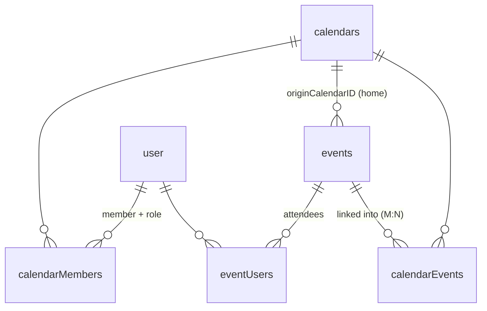

import { Aside, Steps, FileTree } from '@astrojs/starlight/components';

Everything in Musubi hangs off the database schema in **`packages/db/src/schema.ts`** (Drizzle ORM, PostgreSQL). This page is the reference for every table and — more importantly — the *why* behind the junction-table design.

<Aside type="note">
The backend **never** touches tables directly. All database access goes through the **query modules** in `packages/db/src/queries/*.ts`, re-exported from `@musubi/db`. If you're writing a handler and reach for `db.select(...)`, stop — add or reuse a query function instead.
</Aside>

## The domains

The main domains below describe identity, calendar membership, task ownership,
provider mappings, and federation. Schema comment banners and query modules are
the source of truth when adding a table.

### 1. Auth (managed by Better Auth)

| Table | Purpose | Notes |
| --- | --- | --- |
| `user` | Core identity | `email` unique; cascades to everything the user owns. `isExternal` + `homeServer` mark a federated **shadow account** — a member whose real account lives on another Musubi server ([Federation](/docs/architecture/federation/)) |
| `session` | Bearer/session tokens | `token` unique, indexed on `userId` |
| `account` | OAuth + email/password credentials | `providerId` e.g. `"google"`; holds `accessToken`/`refreshToken` |
| `verification` | Email verify + password-reset tokens | indexed on `identifier` |

You rarely edit these — Better Auth's Drizzle adapter owns them. See [Auth in Shared Packages](/docs/architecture/packages/#auth-packagesauth).

### 2. User settings & profile

| Table | Purpose | Notes |
| --- | --- | --- |
| `userSettings` | Preferences (theme, formats, `onboarded`, `calendarOrder` jsonb) | `id` is the user's FK + primary key; lazy-created conflict-safely on first read |
| `userAvatars` | Legacy avatar bytes | Read once into configured media storage, then deleted — see below |
| `userStatus` | `isSponsor` / `isPremium` flags | |
| `pages` | Private per-user calendar view profiles (`config` jsonb + `revision`) | Soft-deleted; partial unique index allows one active default per user; lazily backfilled on first `GET /pages` |

<Aside type="caution">
`userSettings` fields marked optional are **never reset by omission**. `saveUserSettings({ onboarded: undefined })` leaves the stored value untouched — intentional so partial updates don't clobber flags. To actually reset a flag, pass its explicit value.
</Aside>

### 3. Calendars & events

| Table | Purpose | Key columns |
| --- | --- | --- |
| `calendars` | A calendar | `creatorID`, `color`, `isDefault` (one auto-created per user, undeletable) |
| `events` | An event | `title`, `start`/`end`, `isAllDay`, `hasAttendees`, `recurrence`, `creatorID`, **`originCalendarID`**, `deletedAt` |
| `tasks` | One canonical task | `title`, status/progress, start/due/completion, **`originCalendarID`**, `revision`, privacy generation, `deletedAt` |
| `calendarInvites` | Share links | `calendarID`, `expiresAt`, `maxUses` |

<Aside type="caution">
The event/task title column is **`title`**, not `name`. Home foreign keys use
`onDelete: "set null"`, but deleting a home through the supported lifecycle
query tombstones its objects before deleting the calendar. The FK action alone
is not the application deletion policy.
</Aside>

### 4. Link tables — the heart of the design

This is where "events beyond calendars" is implemented. **There is no `calendarId` column on `events`.** Instead:



| Table | Meaning | Cascade / constraint |
| --- | --- | --- |
| `calendarMembers` | who is in a calendar + their `role` | cascades from user & calendar; role defaults `"viewer"`; unique `(userID, calendarID)` — re-joins hit `onConflictDoNothing` instead of duplicating |
| `calendarEvents` | which calendars an event is linked into (M:N) | cascades both sides; unique `(eventID, calendarID)` so retries cannot duplicate a link |
| `calendarTasks` | which calendars a task belongs to (M:N) | cascades both sides; composite primary key `(taskID, calendarID)` |
| `eventUsers` | attendees of an event (creator added on create; presence = attending) | cascades both sides; unique `(eventID, userID)` |
| `calendarInvites` | invite links — the row's uuid `id` IS the token | cascades from calendar; `expiresAt` null = never expires, `maxUses` null = unlimited, `uses` counter checked (with expiry) at every token read |

**Consequences you must respect:**

- To find a user's events, you join `user → calendarMembers → calendars → calendarEvents → events`. There is no shortcut column.
- Deleting a calendar kills the events **homed** in it (`originCalendarID`) everywhere — they're tombstoned *before* the calendar row goes, because the FK would otherwise `set null` their origin and hide them. Events merely *linked* into the deleted calendar survive in their other calendars; only fully **orphaned** ones (no remaining `calendarEvents` links) are removed. See `removeCalendar()` in `queries/calendars.ts`.
- A shared event linked into 3 calendars is *one* row. Editing it edits it everywhere. That's the feature.

<Aside type="note">
`eventUsers` is the attendee list: anyone who can *view* the event may answer going, maybe, declined, or clear their answer (`GET /events/:id/attendees`, `PUT /events/:id/attendance`). The feature is per-event opt-in via `events.hasAttendees` — a UI toggle, **non-destructive**: switching it off keeps the `event_users` rows, so re-enabling restores the same list. The payload is name + avatar only — no emails, since an event can span calendars whose members aren't mutuals. External sync inserts events directly (not via `createEvent`), so provider-imported events don't get a phantom creator-attendee.
</Aside>

### Canonical tasks

Tasks use the event home-authority model, with their own revision and durable
delivery journal. `tasks` stores content and completion once;
`calendar_tasks` stores memberships. The old `tasks.calendarID` remains a
compatibility home field and is not a secondary membership or permission grant.

| Invariant | Implementation |
| --- | --- |
| Read through any currently readable membership | `taskReadableMembership` and `getUserTasks` join current membership and source-access state |
| Edit content, complete/reopen, or delete globally only through home | `originCalendarID` plus home `editTasks`; source rehydration is also required for content edits |
| Link/copy from a currently authorized source into an editable destination | Destination `editTasks`, task support, source privacy checks, and live-link support for links |
| Remove only an editable secondary membership | The home cannot be unlinked or silently promoted elsewhere |
| Detect concurrent edits | Positive server `revision` and an expected revision checked under locks; provider `sequence` remains separate |
| Do not resurrect retired source text from an old draft | `providerReadRetiredGeneration` admission fence and current authorized rehydration |

The read DTO exposes only readable `calendarIDs` and server-derived action
capabilities. Lists, search, and calendar projections deduplicate by logical
task ID. Membership elsewhere does not grant home editing rights or reveal
unreadable calendar names.

Removing a home calendar tombstones the logical task and captures deletes for
surviving provider destinations. Removing a secondary calendar retains the
task's home and identity. Account removal follows the existing creator-purge
policy and captures surviving foreign destination deletes before FK cleanup;
it is not an ownership-transfer operation.

Known provider read revocation retires the source. Home retirement redacts
canonical private text, advances task revision/privacy generation, and
invalidates dependent views. Secondary retirement leaves canonical content in
other authorized memberships intact. Restoring access enables edits, links,
and copies only after an authorized pull restores canonical data and its
accepted provider validator. Global home deletion uses retained addresses
and has a separate content guard.

| Table | Purpose | Identity and retention |
| --- | --- | --- |
| `externalTasks` (`external_tasks`) | Maps a provider projection to the canonical task | Unique `(provider, calendarID, externalTaskID)`; source/account scope, accepted revision, UID, ETag, and projection baseline |
| `taskMutations` (`task_mutations`) | Actor-scoped mutation ledger, including exact fork outcomes | Primary key `(actorID, mutationID)`; no task FK so a tombstone cannot erase intent identity; user removal purges it |
| `taskOutbox` (`task_outbox`) | Immutable destination operations, leases, order, uncertainty, and delivery evidence | Unique `(actorID, mutationID, position)`; no task/calendar/source FK, so accepted deletes and uncertain creation survive lifecycle cleanup |

The outbox's connection-owner FK clears that owner's private evidence on user
removal. Evidence for surviving foreign destinations is retained. HTTP receipts
serialize current authorized reads and sanitized statuses, not the retained
payload or remote address. See [task delivery](/docs/architecture/sync/#task-delivery-and-provider-projections)
and the [task API](/docs/reference/api/#tasks).

### 5. External sync (provider-agnostic)

| Table | Purpose | Unique constraint |
| --- | --- | --- |
| `externalCalendars` | maps a Musubi calendar ↔ a provider calendar | `(provider, accountID, externalCalendarID)` **and** `(calendarID)` |
| `externalEvents` | maps a Musubi event ↔ a provider event | `(provider, calendarID, externalEventID)` |
| `eventOutbox` | durable event provider operations and delivery evidence | actor/mutation/position identity; separate from ordinary event mappings |
| `externalTasks` | maps a canonical task ↔ a scoped provider projection | `(provider, calendarID, externalTaskID)` |
| `caldavAccounts` | CalDAV credentials | `(userID, serverUrl, username)` — multiple accounts per user |

The `(calendarID)` scoping on `externalEvents` is deliberate: two users can mirror the *same* Google calendar (e.g. a shared team calendar) and each keeps an independent mapping. CalDAV passwords in `caldavAccounts.encryptedPassword` are **AES-GCM encrypted at the app layer** — the DB never sees plaintext. Full detail in the [Sync guide](/docs/architecture/sync/).

### 6. Federation

| Table | Purpose | Notes |
| --- | --- | --- |
| `memberTokens` | Bearer tokens for federated shadow members (origin side) | `tokenHash` unique (SHA-256 — raw value never stored); `createdAt` enforces the 90-day lifetime. Rotation is compare-and-swap; removing the final membership deletes the rows transactionally. Authorization remains in `calendar_members`. |
| `musubiAccounts` | This user's connections to *other* Musubi servers (home side) | member token AES-GCM encrypted (same key as CalDAV passwords); `unique(userID, server)` — accept once, every device inherits. See [Federation](/docs/architecture/federation/). |

## Legacy avatar migration

`userAvatars` remains only as a compatibility bridge for installations that
stored avatar bytes in PostgreSQL. First read copies a legacy row to configured
media storage and deletes that row. New uploads go directly to remote S3 when
`S3_BUCKET` is set, or to the persistent local media volume otherwise. Public avatar endpoints and client URLs stay unchanged.

## Soft delete → delta sync

Events are **never hard-deleted on write**. `removeEvent()` sets `deletedAt = now()`. This is what makes offline delta sync possible:

```
client: "give me everything changed since <lastSync>"
server: returns  { events: [...changed...], deletedIds: [...tombstoned...], serverTime }
client: upserts the changed events, drops the deletedIds from its cache, stores serverTime
```

Without `since`, the server returns the full active set (`deletedAt IS NULL`) and the client replaces its cache wholesale. Tombstones older than ~30 days are hard-deleted by an hourly job (`purgeDeletedEvents`). See [`useRefreshData`](/docs/architecture/client/#delta-sync).

## Query modules

`packages/db/src/index.ts` creates the Drizzle client and re-exports every query module plus the schema:

```ts
export const db = drizzle(config.db.databaseUrl, { schema });
export * from './queries/events';
export * from './queries/calendars';
// … users, settings, invites, sessions, external, caldav, oauth
export * as schema from './schema';
```

Query functions are the backend's whole DB vocabulary. Two conventions that matter:

- **Keep a complete database invariant inside one query function.** Calendar
  creation, event creation/link reconciliation/deletion, calendar deletion, and
  ownership transfer use `db.transaction()`. Handlers should not coordinate a
  dependent sequence of raw query calls.
- **Most queries return data or `undefined`/`[]`; handlers map that to HTTP
  errors.** Token and direct calendar lookups are the deliberate exceptions:
  `getCalendarIDFromToken()` and `getCalendar()` throw `NotFoundError`.
- **Delta-aware reads take an optional `since: Date`.** `getUsersEvents(userID, since?)` returns the full set or the changed-since set accordingly.

Ownership transfer additionally selects the calendar `FOR UPDATE`. The row lock
serializes competing transfers before the transaction updates the new owner's
membership, the previous owner's membership, and `calendars.creatorID`.
Provider mirrors cannot transfer ownership: `external_calendars.userID` must
remain the user who owns the corresponding OAuth or CalDAV credentials.

<Aside type="caution">
A database transaction covers PostgreSQL only. Never hold one open while calling
Google, Microsoft, or CalDAV, and never describe provider + database work as
atomic. Use the ordering and recovery semantics in the
[sync architecture](/docs/architecture/sync/#write-path-and-failure-semantics).
</Aside>

## Migration workflow

Migrations are generated by drizzle-kit from the schema diff and committed as SQL.

The v0.2.2 task migrations are additive: **0080** backfills home, memberships,
revision, source-scoped mapping metadata, mutation ledger, and outbox;
**0081** adds the task/source lookup index; **0082** adds a nullable fork request
fingerprint; **0083** records committed/noncommitted fork outcomes. Existing
task UUIDs, provider IDs, UIDs, ETags, tombstones, and `SEQUENCE` are preserved.
Equal provider UIDs do not merge logical tasks. Historical receipts without a
fork fingerprint do not gain replay permission.

Use `pnpm test:db:tasks` against a disposable database to verify migration
preservation and ownership/CAS/lifecycle behavior. See
[Commands](/docs/reference/commands/) for test setup and the release-specific
records under `docs/releases/` for deployment requirements. A successful startup
migrator log is not independent proof of a production migration journal or
preserved row counts.

<Steps>

1. Edit `packages/db/src/schema.ts` (add/change a column, table, index, constraint).

2. Generate the migration from the diff:

   ```sh
   pnpm db:generate
   ```

   This writes a numbered `packages/db/drizzle/00XX_*.sql` plus a snapshot under `drizzle/meta/`.

3. **Review the generated SQL.** Check constraints, cascade rules, and indexes are what you intended.

4. Apply it to your local database:

   ```sh
   pnpm db:migrate
   ```

5. Commit the generated SQL and snapshot *together with* your schema change.

</Steps>

<Aside type="caution">
**Gotchas that bite:**

- **Forgetting `db:generate`** leaves the migration history out of sync with `schema.ts`; the next change will re-emit the missed diff. Always generate right after editing the schema.
- **Renames** aren't detected — drizzle-kit emits `DROP` + `CREATE` (data loss). If you need a true rename, hand-edit the migration to `ALTER TABLE … RENAME COLUMN`.
- **User deletion cascades to everything** (sessions, accounts, calendars, events, settings, avatars, external links). Test destructive changes on throwaway data.

</Aside>

## If you're adding a data field, do this in order

<Steps>
1. Add the column in `packages/db/src/schema.ts`.
2. `pnpm db:generate` → review SQL → `pnpm db:migrate`.
3. Add it to the Zod schema in `packages/types` so both apps get the type ([why](/docs/architecture/packages/#types-packagestypes)).
4. Thread it through the relevant query function, API handler, client `useApi` method, and store.
5. If the client caches it, add it to `apps/client/db/schema.ts` (the local SQLite mirror) and generate a client migration too.
</Steps>
