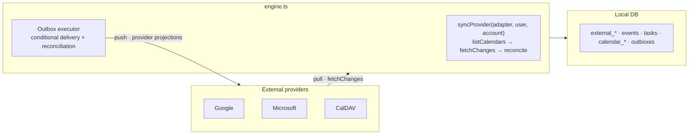

import { Aside, Steps } from '@astrojs/starlight/components';

Two-way external calendar sync is Musubi's most distinctive subsystem. It lives
in `apps/api/src/sync/` and is **provider-agnostic**: the engine does not talk to
a provider directly — it routes through a small adapter contract. Google,
Microsoft Graph, and CalDAV are the current implementations.

For the user-facing task flow, see [Shared tasks](/docs/guides/shared-tasks/).
This page describes engine invariants; the [HTTP API](/docs/reference/api/#tasks)
defines the task protocol and receipts.

## Mental model



Each connected provider account produces **mirror calendars** — ordinary
Musubi calendars with an `externalCalendars` mapping. These can support events,
tasks, or both. Events enter the unified `events` table; provider tasks enter
canonical `tasks` with scoped `external_tasks` projections.

- **Pull** (provider → local): `fetchChanges` returns normalized objects; the
  engine reconciles them with current source access and pending writes.
- **Push** (local → provider): handlers commit canonical changes and durable
  outbox operations; executors call the adapter outside the DB transaction.

## The adapter contract

`sync/adapter.ts` defines the complete contract. The following event subset is
an orientation sketch; task, source-access, provider evidence, and specialized
event operations are also part of the real interface.

```ts
type NormalizedEvent = {
  externalId: string;
  status: "active" | "cancelled";   // cancelled ⇒ delete locally
  title: string;
  start: Date; end: Date;           // stored instants; Musubi all-day end is inclusive
  isAllDay: boolean;
  description: string | null; location: string | null;
  organizer: string | null;
  recurrence: string | null;        // iCal RRULE text (+ EXDATE lines)
  url: string | null;
  etag?: string | null;             // CalDAV conflict detection
};

type ExternalCalendarInfo = { externalId; name; color; readOnly?: boolean };
type CalendarDiscoveryResult = {
  calendars: ExternalCalendarInfo[];
  taskListsComplete: boolean;       // false: absence cannot retire task sources
  availabilityCalendars?: { externalId: string; name: string }[];
};
type NormalizedChange =
  | { kind: "event"; data: NormalizedEvent }
  | { kind: "event-resource"; externalId: string; events: NormalizedEvent[] }
  | { kind: "task"; data: NormalizedTask };
type FetchChangesResult = { changes: NormalizedChange[]; nextCursor: string | null; reset?: boolean };

interface CalendarAdapter {
  listAccounts(userID): Promise<{ id; label }[]>;
  listCalendars(userID, accountId): Promise<CalendarDiscoveryResult>;
  fetchChanges(userID, accountId, externalCalendarId, cursor): Promise<FetchChangesResult>;
  pushCreate(userID, accountId, externalCalendarId, event): Promise<{ externalEventId }>;
  pushUpdate(userID, accountId, externalCalendarId, externalEventId, event, ref?, patch?, signal?): Promise<{ etag?; icalUid? } | void>;
  pushDelete(userID, accountId, externalCalendarId, externalEventId): Promise<void>;

  // calendar-level writes — create / rename+recolor / delete the calendar itself
  createCalendar(userID, accountId, { name, color }): Promise<{ externalId }>;
  updateCalendar(userID, accountId, externalCalendarId, { name, color }): Promise<void>;
  deleteCalendar(userID, accountId, externalCalendarId): Promise<void>;
}
```

Event-capable adapters translate their provider's format to and from
`NormalizedEvent`; provider-specific evidence remains part of the full contract.

Tasks use `NormalizedTask`, `ExternalTaskRef`, and a provider-supported
`TaskProjection`. Task-capable adapters implement `projectTask`,
`assertTaskWrite`, `readTask`, and `pushTaskCreate/Update/Delete`. Discovery's
`supportsEvents` and `supportsTasks` flags prevent an event-only collection from
being treated as a task destination. `supportsTaskLinks` adds the separate
client/server policy for safely maintaining live task memberships.

### Calendar-level writes

Mirrors are editable and deletable from Musubi, and `POST /calendars` can create
a calendar **into** a connected account. The calendar handlers apply these
**provider-first**: the adapter call runs before the local write, and a provider
rejection (Google refusing to delete a primary calendar, an expired token…)
prevents the local mutation. A later local database failure can still leave a
provider-only change, so this is ordering, not a distributed transaction.

Only the user whose account backs the mirror may perform these operations
(`external_calendars.userID` check); read-only mirrors map to `viewer`, so
`assertCan` blocks writes. Provider quirks stay in adapters: Google color lives
on the per-user `calendarList` entry, Microsoft maps hex to its nearest preset,
and CalDAV uses raw `MKCALENDAR` / `PROPPATCH` / `DELETE`.

### Write path and failure semantics

Event writes use a different contract. Every dependent **local** write is
transactional: create commits the event, creator-attendee, and links together;
update commits the event, link diff, and removed mappings together; delete
commits unlinking and the possible final tombstone together.

Provider calls remain outside PostgreSQL. Event handlers preflight the full known
intent, then commit local event/link changes and `event_outbox` rows together.
Remote delete addresses are captured before unlink removes ordinary mappings.
The request claims each persisted operation before its first conditional delivery;
there is no second legacy inline sender. Postcommit failures return truthful
`localCommitted`, revision and sanitized partial/unconfirmed receipts.

The current outbox executor preserves pending/attempting intent across process
exit and supports ordered recovery. Unresolved predecessors block later
attempts. Renewable leases fence dispatch and acknowledgements; expired
attempts must reconcile observed provider state before another write is
admitted. This is not a distributed transaction or a guarantee of eventual
delivery. Unsupported writes and unresolved conflicts remain visible.

| Mutation | Ordering | Current failure result |
| --- | --- | --- |
| Calendar create/update/delete | Provider, then local DB | Provider rejection aborts local change; later DB failure can diverge |
| Event create/update/delete/link/unlink/fork | Preflight, local CAS + outbox transaction, claimed provider delivery | Precommit failure rolls back; postcommit conflict/unconfirmed response retains local revision and durable intent |
| Task create/update/delete/link/unlink/fork | Source/projection preflight, local revision/privacy CAS + task outbox transaction, postcommit wakeup | Explicit local commit receipt; delivery may remain pending, blocked, conflicting, or unconfirmed |
| Scheduled pull | Provider fetch, then scoped local reconciliation | Account/provider failures are isolated; admitted pending writes and privacy retirement constrain what the pull may accept |

Disconnecting one provider account uses `removeExternalAccountData()` to remove
all of its local mirrors, events, opt-out tombstones, and (for CalDAV) stored
credentials in one transaction. Google revocation and Better Auth OAuth unlink
still sit outside PostgreSQL and therefore keep the same cross-system boundary.

See the [observability runbook](/docs/operations/observability/#incident-triage).

### Task delivery and provider projections

`prepareTaskWrites` captures destination source/account scope, accepted
validators, and the immutable provider projection before mutation admission.
The task query rechecks rights, expected task revision, privacy generation, and
source admission under locks. Canonical content/membership/tombstone changes,
the actor's mutation ledger entry, and `task_outbox` intents commit together.
No provider HTTP runs while that transaction is open.

Only an authorized **home pull** changes canonical task content. Secondary
pulls acknowledge their own projection; they do not acquire completion
authority. Comparing supported provider fields with the accepted projection
baseline prevents a lossy provider serialization from erasing richer canonical
fields. Home changes fan out to supported secondary providers. Secondary
deletion does not globally delete a task, and retained delete addresses prevent
late source reads from reimporting deleted copies as new identities.

The task executor captures source/account identity, predecessor order,
renewable lease, and uncertainty before dispatch. Mapping acknowledgement is
guarded so a late HTTP response cannot change canonical authority. Delivery
evidence has no task/calendar/source FK: it survives unlink, deletion, or source
removal. Removing the connection owner purges that owner's private evidence;
surviving foreign destinations keep theirs.

An expired or uncertain CREATE must reconcile by observation rather than
blindly create again. Google Tasks and Microsoft To Do cannot safely replay an
uncertain creation without a remote address. CalDAV can read its deterministic
resource URL to reconcile it. A preflight GET or an ETag-shaped string alone
does not prove conditional update/delete support: Microsoft secondary writes
remain blocked, and new live links to To Do are refused. Independent copies
use their destination as a new home and retain ordinary home-write behavior.

Recurring tasks can retain native memberships and existing home recurrence;
multiple external projections are refused until there is one occurrence
generator. Clients offer only native targets when sharing recurrence. For
field-level provider limits, see [Google](/docs/providers/google/),
[Microsoft](/docs/providers/microsoft/), and [CalDAV](/docs/providers/caldav/).

Request wakeups and `drainTaskOutbox` use the same executor. When
`EXTERNAL_SYNC_INTERVAL_MIN > 0`, the process runs the shared event/task outbox
drain at startup and every **15 seconds**, independently of the provider-pull
interval. Setting that variable to **0 disables background outbox recovery as
well as scheduled pulls**; request wakeups still operate. Each task drain takes
up to 40 due candidates with four workers.

Clients consume `localCommitted` before deciding whether to keep a draft.
Delivery discovery/status/retry uses the [task delivery API](/docs/reference/api/#delivery-receipts-and-retry),
which exposes only current authorized titles and sanitized destination states.
Only proven-not-written owned operations with current destination authority
can be retried. A local save or an empty metrics result does not establish that
all remote destinations have acknowledged the change.

## The engine

`sync/engine.ts` orchestrates one account at a time in `syncProvider()`:

<Steps>

1. **Reconcile calendars.** `listCalendars()` → delete local mirrors gone on the provider (`removeCalendar` cascades orphans), import new ones (`importExternalCalendar`), and refresh the read-only flag. `readOnly: true` maps to `calendar_members.role = "viewer"`.

2. **Pull objects.** For each mirror, `fetchChanges(cursor)`. Per event,
   cancellation goes through `deleteExternalEvent`; active observations go
   through the scoped upsert/resource/family reconciliation paths. Task-capable
   mirrors also use `upsertExternalTask` and `deleteExternalTask` with captured
   source scope. A complete `reset: true` fetch sweeps missing objects after
   reconciliation instead of tombstoning the entire mirror first. Persist
   `nextCursor` only for an accepted fetch.

</Steps>

`syncUser(userID)` discovers accounts per provider, then wraps every account sync
independently. One expired Google account therefore neither aborts a second Google
account nor CalDAV. Account failures include the concrete `accountId` in structured
logs; provider-level discovery failures use `sync.provider.failed`.

The CalDAV connect handler uses the same path in an account-scoped strict mode
(`syncUser(userID, { provider: "caldav", accountId, throwOnError: true })`). This
makes the first calendar/event import part of a successful connection and returns
an import failure to the client. Scheduled syncs keep the default best-effort
behaviour.

## Near-realtime: the scheduled sync

Provider changes reach the app without a manual pull-to-refresh through a three-piece loop:

1. **Scheduler** (`apps/api/src/index.ts`): every `EXTERNAL_SYNC_INTERVAL_MIN` minutes (default 5, `0` disables), the server runs `syncUser` for every user who has at least one provider mirror (`getExternalSyncUserIDs`).
2. **Change detection**: an unchanged accepted ETag is a verified no-op, with no
   `updatedAt` bump or redundant broadcast. Incremental reads process explicit
   deletion observations. A complete `reset: true` read sweeps missing objects
   after reconciliation: for example initial/expired Google Calendar cursors or
   CalDAV's complete-read fallback. CalDAV does not reset on every sync when
   `sync-collection` is supported. Partial reads never authorize a sweep.
3. **Broadcast → silent refresh**: when a calendar really changed, `syncUser` sends an SSE `external_sync` frame to its affected readers; clients refresh events and tasks without triggering provider sync again, so the refresh cannot loop. Human task mutations also emit task ID/revision/actor frames; provider pulls do not invent another human actor.

<Aside type="note">
Musubi currently installs no provider webhook or push subscription. Google watch
channels require a publicly reachable endpoint plus renewal and channel
management. The shared poll path works across the configured providers and
self-hosted installations; a future push trigger can call the same sync path
without replacing its access and change-detection checks.
</Aside>

<Aside type="caution">
The API supports one process per database and enforces that boundary with a
session-scoped PostgreSQL advisory lock. Within that process, the scheduler is
single-flight: if a run outlasts its interval, the next tick is skipped, logged
as `sync.scheduler.skipped`, and counted by
`musubi_scheduled_task_skips_total{task="external_sync"}`. Do not bypass the
singleton lock to scale horizontally; shared pub/sub and rate limiting are
still required. See
[Current scaling boundary](/docs/operations/observability/#current-scaling-boundary).
</Aside>

Two correctness details worth knowing: provider **deletions tombstone** (`deletedAt`) rather than hard-delete, so offline clients learn about them through the delta's `deletedIds` (a hard delete just vanished — stale caches kept the event forever); and a client-originated push echoes back on the next poll as a write (values identical), which is harmless.

<Aside type="note">
`organizer` is `NOT NULL` in the schema but adapters may hand back `null` — the engine falls back to `""`. `color` on synced events comes from the **mirror calendar**, not the provider event.
</Aside>

## Account disconnect semantics

The current client disconnects exactly one `{ provider, accountId }` through
`POST /api/v1/users/connections/disconnect`. The handler:

1. best-effort revokes that Google account's refresh token (Microsoft has no
   equivalent step here);
2. removes only mirror calendars and disabled-calendar markers for that account;
3. asks Better Auth to unlink that exact account; and
4. if Better Auth refuses—most commonly because it is the user's final login
   account—clears calendar tokens/scope only on the matching
   `(user, provider, accountId)` row.

This preserves sibling Google/Microsoft accounts. The legacy
`POST /api/v1/users/connections/google/revoke` route has no `accountId` and is
intentionally provider-wide for old clients; do not use or describe it as an
exact-account operation.

## Credential crypto

`sync/crypto.ts` encrypts CalDAV passwords with **AES-256-GCM** before they hit `caldav_accounts.encryptedPassword`:

```
encryptSecret(plaintext) → "base64(iv):base64(tag):base64(ciphertext)"   (fresh 12-byte IV each time)
decryptSecret(blob)      → verifies the auth tag, throws on tampering
```

The key is `CALDAV_ENC_KEY` (64 hex chars = 32 bytes; generate with `openssl rand -hex 32`). Plaintext is decrypted only when building a CalDAV client, never stored or logged. Without the key set, CalDAV connection fails at use time (not boot).

## Provider specifics (the gotcha zones)

Most sync bugs are recurrence and all-day edge cases. The existing adapters already handle these — study them before writing a new one.

**Google (`adapters/google.ts`):**

- The adapter refreshes expired access tokens against Google's token endpoint so
  it can retain the safe OAuth `error`/`error_subtype` codes that Better Auth's
  generic `getAccessToken` error otherwise discards. Tokens and error descriptions
  are never logged.
- `invalid_grant` is permanent until the user authorizes again. The account row is
  marked `sync_status = reconnect_required`, its dead tokens are cleared, and
  `listAccounts()` excludes it from later scheduled runs. Existing mirrors remain
  visible with a reconnect action. A successful Better Auth OAuth relink resets the
  status to `active` through the account update hook.
- Network failures, rate limits, 5xx responses, and server OAuth configuration
  errors remain retryable and do **not** disable an individual user's account.
- `sanitizeRecurrence()` fixes three iCal quirks: `EXDATE;TZID=…` (the rrule lib ignores TZID → convert to UTC), all-day `EXDATE` must be `VALUE=DATE`, and `FREQ=YEARLY;BYMONTHDAY` without `BYMONTH` (RFC expands monthly → anchor the month).
- Incremental sync via `syncToken`; `410 Gone` → return `reset: true`.
- All-day end is **exclusive** (±1 day on pull/push).

**Microsoft (`adapters/microsoft.ts`):**

- OAuth mirrors the Google lifecycle exactly — both adapters share `sync/oauth.ts`
  (token refresh, `invalid_grant` → `reconnect_required`) and the generic
  `queries/oauth.ts` account queries. One Microsoft quirk handled there: the
  refresh token may rotate; a returned replacement must be re-persisted.
- Incremental sync via Graph **calendarView delta**. v1.0 has no unbounded event
  delta, so the delta token is bound to a fixed date window (`WINDOW_*` constants,
  currently −180d…+730d). The cursor stores `{link, windowEnd}`; when the future
  edge gets within 90 days, the adapter forces `reset: true` with a fresh window.
  Events outside the window don't exist in the mirror — a rolling view, not full
  history.
- Ordinary **calendarView imports arrive pre-expanded** as occurrence/exception
  rows. They are not silently adopted as canonical Musubi series. A separate
  bounded personal-create/tracked-family path maps exactly representable finite
  COUNT/UNTIL rules, preserves family identity and uses durable recovery. The
  generic writer still refuses recurrence. Specialized occurrence/series
  content, time, selected moves, cancellation and finite attendee RSVP each have
  their own native proof; see the [current capability matrix](/docs/operations/capabilities/).
- `Prefer: outlook.timezone="UTC", outlook.body-content-type="text"` on every
  read — times come back UTC and bodies as plain text.
- Graph only accepts preset color names (`hexColor` is read-only), so create and
  update map the chosen Musubi hex to the nearest Graph preset.

**CalDAV (`adapters/caldav.ts` + `caldav_client.ts`):**

- Wraps `tsdav`; Basic auth; principal/home discovery is automatic (incl. iCloud hosts).
- Events parsed via `ical.js`; `externalId` is the **resource URL**, not the UID.
- Uses incremental `sync-collection` when advertised by the collection. An
  initial/expired/unsupported token or failed incremental read falls back to a
  complete collection query with `reset: true`, covering events and tasks.
  Only the accepted complete result authorizes missing-object reconciliation.
- Passwords are trimmed (mobile clipboards add whitespace) then decrypted per request.

<Aside type="caution">
**Preserve the native recurrence family.** A complete resource replacement must
retain the full supported RRULE, RDATE/EXDATE and detached-component evidence,
including untouched raw fields. A minimal provider PATCH instead omits fields
outside its explicit operation; it must not replace recurrence merely to change
a title. Use the provider-specific scope contract and exact readback rather than
applying one serializer rule to Google, Graph and CalDAV. Unsupported shapes are
refused before writing.
</Aside>

## How to add a provider

<Steps>

1. **Create `adapters/<provider>.ts`** implementing `CalendarAdapter`. Translate the provider's API to/from `NormalizedEvent`.

2. **Credentials.** OAuth: add the provider to Better Auth (`packages/auth`) and implement `listAccounts()` against the `account` table. Preserve the provider's machine-readable refresh error code so permanent revocation can be distinguished from a transient outage. Password-based: model it on `caldav_accounts` and **encrypt with `encryptSecret()`**.

3. **`fetchChanges`.** Paginate internally, accumulate all pages into one `changes` array, return the provider's opaque `nextCursor`. Map cursor-expiry errors to `reset: true`.

4. **`push*` idempotency.** Deletes must treat 404/410 as success.

5. **Register in the engine** — add `<provider>: <adapter>` to the registry map in `engine.ts`. The `externalCalendars.provider` / `externalEvents.provider` columns are free-form strings, so **no schema change is needed**.

6. **Wire connect/disconnect handlers** (model on `handlers/caldav.ts` / `handlers/google.ts`) and trigger an initial `syncUser()`.

</Steps>

## Testing provider boundaries

`pnpm test` includes two provider-neutral safety nets:

- `sync/orchestrator.test.ts` proves discovery/account failures are isolated,
  retryable accounts run again on the next cycle, strict connect flows throw,
  and provider/account filters do not leak work; and
- `sync/adapters/provider_http.test.ts` runs local fake Google/Graph servers to
  exercise multi-page deltas, `410` cursor reset, partial-result discard,
  Microsoft series-master cache reset/reuse and safe caller retry.

For stored credential behavior, run `pnpm test:provider-db` against a disposable
migrated PostgreSQL database. Its fake token endpoint verifies encrypted access
and refresh-token rotation, account-scoped `invalid_grant`, sibling preservation
and transient failure retry. See [Commands](/docs/reference/commands/#provider-database-integration)
for the required test-only environment.

These checks intentionally do not impersonate a live provider. Before a
release that changes an adapter, still perform one sandbox round trip with real
credentials: connect, initial pull, incremental pull, create/update/delete,
token refresh and disconnect.

### Adapter checklist

- [ ] Cursor expiry → complete `reset: true` fetch so the engine reconciles and sweeps missing objects
- [ ] Read-only calendars (holidays, subscriptions) → `readOnly: true`
- [ ] All-day end is exclusive — adjust ±1 day on pull/push
- [ ] Recurrence: normalise provider format to iCal RRULE; EXDATE value-type must match DTSTART
- [ ] EXDATE with a TZID → convert to UTC (rrule lib ignores TZID)
- [ ] Push includes full RRULE + EXDATE on every update
- [ ] `organizer` may be null → engine defaults to `""`
- [ ] Multiple accounts per provider supported via `listAccounts()`
- [ ] Deletes idempotent (404/410 = success)
- [ ] Calendar-level ops (`createCalendar`/`updateCalendar`/`deleteCalendar`) throw on provider rejection — the handlers rely on that to abort the local write

## Reference

For setup and provider-specific debugging, use the dedicated guides:
[Google](/docs/providers/google/),
[Microsoft / Outlook](/docs/providers/microsoft/), and
[Apple / CalDAV](/docs/providers/caldav/).

| File | Contents |
| --- | --- |
| `sync/engine.ts` | `syncProvider`, `syncUser`, `prepareEventWrites`, registry |
| `sync/orchestrator.ts` | Provider/account failure boundary, strict/scoped selection |
| `sync/adapter.ts` | `NormalizedEvent`, `ExternalCalendarInfo`, `FetchChangesResult`, `CalendarAdapter` |
| `sync/adapters/google.ts` | Google Calendar adapter |
| `sync/adapters/microsoft.ts` | Microsoft Outlook adapter (Graph calendarView delta) |
| `sync/adapters/caldav.ts` + `caldav_client.ts` | CalDAV adapter (Apple/iCloud + generic) |
| `sync/oauth.ts` | shared OAuth access-token refresh (google + microsoft) |
| `sync/crypto.ts` | AES-256-GCM `encryptSecret`/`decryptSecret` |
| `packages/db/src/queries/external.ts` | `upsertExternalEvent`, `clearCalendarEvents`, `removeExternalAccountData`, cursor & link helpers |
| `sync/task_delivery.ts` | Task outbox dispatch and read-only uncertainty reconciliation |
| `packages/db/src/queries/tasks.ts` | Task ownership, revision/privacy admission, link/fork/unlink and mutation ledger |
| `packages/db/src/queries/task-outbox.ts` | Immutable task intents, source fences, order, leases and guarded acknowledgement |
| `packages/db/src/queries/task-delivery-status.ts` | Authorized receipts, keyset discovery and exact-operation retry admission |
